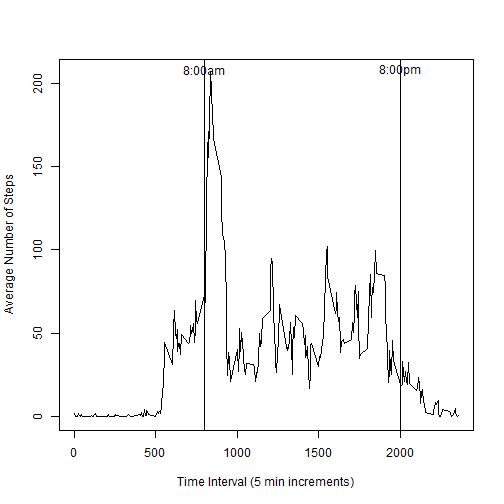

## Loading and preprocessing the data

Show any code that is needed to:

**1.	Load the data (i.e. read.csv())**

*Read in the data*

```r
setwd("C:/Users/Kellie/OneDrive/Copies/Coursera/Data Science Specialization/Reproducible Research/Project 1")
df <- read.csv("activity.csv")
str(df)
```

```
## 'data.frame':	17568 obs. of  3 variables:
##  $ steps   : int  NA NA NA NA NA NA NA NA NA NA ...
##  $ date    : Factor w/ 61 levels "2012-10-01","2012-10-02",..: 1 1 1 1 1 1 1 1 1 1 ...
##  $ interval: int  0 5 10 15 20 25 30 35 40 45 ...
```
*The variables included in this dataset are:*

*steps: Number of steps taking in a 5-minute interval (missing values are coded as NA)*  
*date: The date on which the measurement was taken in YYYY-MM-DD format*  
*interval: The 5-minute interval in which measurement was taken (i.e., 800 is 8:00)*


**2.	Process/transform the data (if necessary) into a format suitable for your analysis**  
*I want to convert the string date column to an R date column*


```r
df$date <- as.Date(df$date)
```

## What is mean total number of steps taken per day?

For this part of the assignment, you can ignore the missing values in the dataset.  
**1. Calculate the total number of steps taken per day**

```r
numsteps <- aggregate(df$steps~df$date, FUN=sum) #default will ignore NAs
head(numsteps)
```

```
##      df$date df$steps
## 1 2012-10-02      126
## 2 2012-10-03    11352
## 3 2012-10-04    12116
## 4 2012-10-05    13294
## 5 2012-10-06    15420
## 6 2012-10-07    11015
```

```r
colnames(numsteps) <- c("Date","TotalSteps")
```
**2. If you do not understand the difference between a histogram and a barplot, research the difference between them.**  
Make a histogram of the total number of steps taken each day

```r
hist(numsteps$TotalSteps, breaks=10, main="Total number of steps taken each day",xlab="Total Daily Steps")
```

 
**3. Calculate and report the mean and median of the total number of steps taken per day**

```r
origmean <- round(mean(numsteps$TotalSteps),0)
origmean
```

```
## [1] 10766
```

```r
origmedian <- round(median(numsteps$TotalSteps),0)
origmedian
```

```
## [1] 10765
```

```r
options(scipen=999) #to get rid of scientific notation
```
*The mean total number of steps is 10766.*  
*The median total number of steps is 10765.*  

## What is the average daily activity pattern?
**1.	Make a time series plot (i.e. type = "l") of the 5-minute interval (x-axis) and the average number of steps taken, averaged across all days (y-axis)**  
*Create a table of average steps by interval.*

```r
avesteps <- aggregate(df$steps~df$interval, FUN=mean) #default will ignore NAs
colnames(avesteps) <- c("Interval","AverageSteps")
```
*Plot the average steps.*

```r
plot(avesteps$Interval,avesteps$AverageSteps, type="l", ylab="Average Number of Steps", xlab="Time Interval (5 min increments)")
abline(v=800) ##line indicating 8a (8:00)
abline(v=2000) ##line indicating 8p (20:00)
text(800,208,labels="8:00am")
text(2000,208,labels="8:00pm")
```

 
**2.	Which 5-minute interval, on average across all the days in the dataset, contains the maximum number of steps?**  

```r
largindex <- which.max(avesteps$AverageSteps) #finds the index of the largest value
largint <- avesteps$Interval[largindex]
largstep <- avesteps$AverageSteps[largindex]
```
The largest value is Time Interval 835 with average steps: 206.1698113. This can be seen from the plot as the highest value is shortly after 8:00am.


## Imputing missing values
Note that there are a number of days/intervals where there are missing values (coded as NA). The presence of missing days may introduce bias into some calculations or summaries of the data.  
**1.	Calculate and report the total number of missing values in the dataset (i.e. the total number of rows with NAs)**

```r
summary(df$interval)
```

```
##    Min. 1st Qu.  Median    Mean 3rd Qu.    Max. 
##     0.0   588.8  1178.0  1178.0  1766.0  2355.0
```

```r
summary(df$steps)
```

```
##    Min. 1st Qu.  Median    Mean 3rd Qu.    Max.    NA's 
##    0.00    0.00    0.00   37.38   12.00  806.00    2304
```

```r
MissStep <- summary(df$steps)[7]
```
There are no missing Time Interval values.
There are 2304 missing step values.


**2. Devise a strategy for filling in all of the missing values in the dataset.**  

The strategy does not need to be sophisticated. For example, you could use the mean/median for that day, or the mean for that 5-minute interval, etc.

*My strategy:*  
*I would like to use median for that time interval, but I want to use a distribution around the median so the data doesn't end up with spikes at the median. So I'm going to randomly sample a value between the 45th and 55th quantiles so it gives us a range around the median (50th quantile) that the values can come from.*  

*the sample(min:max, n,replace=TRUE)  function will randomly sample from Discrete U(min,max)*  

**3.	Create a new dataset that is equal to the original dataset but with the missing data filled in.**  

*First, I'm going to store the 45th and 55th quantile values for each interval*


```r
quant55 <- aggregate(df$steps~df$interval, FUN=quantile, probs=.55) #default will ignore NAs
colnames(quant55) <- c("Interval","Quant55")
quant45 <- aggregate(df$steps~df$interval, FUN=quantile, probs=.45) #default will ignore NAs
colnames(quant45) <- c("Interval","Quant45")
interv4555 <- merge(quant45,quant55)
```
*Next, loop through all values and create new column stepsImp that will either be original steps or randomly generated value between 45th-55th *

```r
df2 <- df
for (i in 1:nrow(df2))
    if (is.na(df2$steps[i])) {
        minimp = interv4555[interv4555$Interval==df2$interval[i],"Quant45"]
        maximp = interv4555[interv4555$Interval==df2$interval[i],"Quant55"]
        imp = sample(minimp:maximp,1) #generate 1 value D uniform between min & max
        df2$stepsImp[i] <- imp
    } else {
        df2$stepsImp[i] <-df2$steps[i]}
```

**4.	Make a histogram of the total number of steps taken each day and Calculate and report the mean and median total number of steps taken per day.**  
*First, I will calculate the total imputed steps by date and store the mean and median in variables.*  

```r
numsteps2 <- aggregate(df2$stepsImp~df2$date, FUN=sum) #default will ignore NAs
head(numsteps2)
```

```
##     df2$date df2$stepsImp
## 1 2012-10-01       1162.8
## 2 2012-10-02        126.0
## 3 2012-10-03      11352.0
## 4 2012-10-04      12116.0
## 5 2012-10-05      13294.0
## 6 2012-10-06      15420.0
```

```r
colnames(numsteps2) <- c("Date","TotalSteps")
impmean <- round(mean(numsteps2$TotalSteps),0)
impmean
```

```
## [1] 9511
```

```r
impmedian <- round(median(numsteps2$TotalSteps),0)
impmedian
```

```
## [1] 10395
```
*Then, I will plot a histogram.*  

```r
par(mfrow=c(2,1))
hist(numsteps2$TotalSteps, breaks=10, main="Total number of steps (imputed NAs) taken each day",xlab="Total Daily Steps",sub=paste("Mean: ",impmean," Median: ",impmedian))
hist(numsteps$TotalSteps, breaks=10, main="Total number of steps taken each day",xlab="Total Daily Steps",sub=paste("Mean: ",origmean," Median: ",origmedian))
```

 

```r
par(mfrow=c(1,1))
```

Do these values differ from the estimates from the first part of the assignment? What is the impact of imputing missing data on the estimates of the total daily number of steps?

*The numbers are different - the histogram shows a lot more lower counts - so the mean and median are lower for the histogram with imputed data. I think that there were a lot of NAs that happened in the early hours of the day that are ignored in the original data and then show up as imputed 0 or very low counts.*


```r
numstepsNA <- aggregate(df$steps~df$date, FUN=sum,na.action=na.pass)
numdays <- length(unique(numstepsNA$`df$date`))
numNAs <- summary(numstepsNA)[7,2]
```
*There are 61 days and the number of days with NA's   :8   so we can see that impacts a great deal the new histogram with imputed missing values.*


## Are there differences in activity patterns between weekdays and weekends?

For this part the weekdays() function may be of some help here. Use the dataset with the filled-in missing values for this part.

**1.	Create a new factor variable in the dataset with two levels ‚<U+0080><U+0093> ‚<U+0080><U+009C>weekday‚<U+0080>ù and ‚<U+0080><U+009C>weekend‚<U+0080>ù indicating whether a given date is a weekday or weekend day.**

```r
df2$Weekday <- weekdays(df2$date)
for (i in 1:nrow(df2))
    if (df2$Weekday[i] == "Sunday" | df2$Weekday[i]=="Saturday") {
        df2$WeekType[i] <- "weekend"
    } else{
        df2$WeekType[i] <- "weekday" }
        df2$WeekType <- as.factor(df2$WeekType)
```

**2.	Make a panel plot containing a time series plot (i.e. type = "l") of the 5-minute interval (x-axis) and the average number of steps taken, 
averaged across all weekday days or weekend days (y-axis). **
See the README file in the GitHub repository to see an example of what this plot should look like using simulated data.  
*First, I will create the average steps by weekend/day and Time interval.*

```r
avesteps2 <- aggregate(df2$stepsImp~df2$WeekType + df2$interval, FUN=mean) #default will ignore NAs
colnames(avesteps2) <- c("WeekType","Interval","AverageSteps")
```
*Next, I will plot the data.*

```r
library(ggplot2)
g <- ggplot(avesteps2, aes(Interval, AverageSteps))+geom_line(color="blue") 
g <- g + labs(y="Average Number of Steps", x="Time Interval (5 min increments)") + facet_wrap(~WeekType,nrow=2)
g <- g + geom_vline(xintercept = (800)) #line indicating 8a (8:00)
g <- g + geom_vline(xintercept = (2000)) #line indicating 8pm (20:00)
g <- g + annotate("text",x=800,y=220,label="8:00am")
g <- g + annotate("text",x=2000,y=220,label="8:00pm")
g <- g + theme_bw()
g
```

 
*We can see that on weekends the high time intervals of steps are more spread out and people seem to start moving later in the day but stay moving later into the evening after 8:00pm.*

